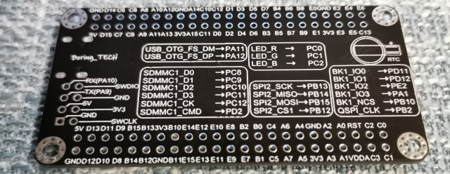
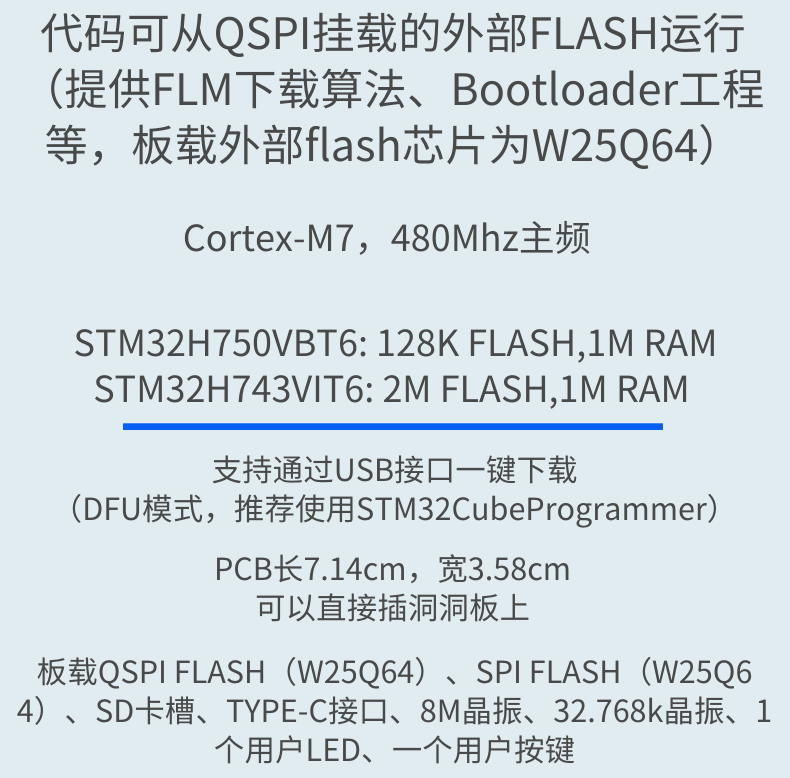

## Boring_TECH STM32H743VIT6 Board Definition for MicroPython





### Build the Firmware
* Install the dependencies
* Clone the official MicroPython repo
* Build cross compiler
* Create a folder under `ports/stm32/boards/`, e.g. `ports/stm32/boards/BORINGTECH_STM32H743`
* Copy the definition files to the above folder
* Back to path `ports/stm32`
* Build the firmware with command `make BOARD=BORINGTECH_STM32H743`
* See [here](https://github.com/micropython/micropython/wiki/Getting-Started)
and [here](https://github.com/micropython/micropython/wiki/Building-Micropython-Binaries)

### Flash the Firmware

* Install [STM32CubeProgrammer](https://www.st.com/zh/development-tools/stm32cubeprog.html)
* Keep pressing the `BOOT` button on the board, then connect the USB cable.
* Release the `BOOT` button.
* Click refresh button on the right panel of the STM32CubeProgrammer.
* Select the port from the dropdown menu and click 'Connect'.
* Click 'Open file' tab to select the `firmware.hex`.
* Click 'Download' to flash the firmware, wait until it finishes.
* Press `RST` button on the board to reset.

---

### Exposed Port Pins

* PA0-PA15
* PB0-PB15
* PC0-PC13 (PC14 OSC32_IN and PC15 OSC32_OUT not broken out)
* PD0-PD15
* PE0-PE15

### Peripherals

#### RGB LED - _common anode, low active_

* LED_R: PC0
* LED_G: PC1
* LED_B: PC2

#### User Button

* PC13

#### QSPI Flash W25Q64 (8MB)

* QSPI_BK1_IO0: PD11
* QSPI_BK1_IO1: PD12
* QSPI_BK1_IO2: PE2
* QSPI_BK1_IO3: PA1
* QSPI_BK1_NCS: PB10
* QSPI_CLK: PB2

#### SPI Flash W25Q64 (8MB) - _not used in this definition_

* SPI2_CS: PB12
* SPI2_SCK: PB13
* SPI2_MISO: PB14
* SPI2_MOSI: PB15

#### MicroSD Slot - _there's no card detect pin_

* SDMMC1_D0: PC8
* SDMMC1_D1: PC9
* SDMMC1_D2: PC10
* SDMMC1_D3: PC11
* SDMMC1_CK: PC12
* SDMMC1_CMD: PD2

#### USB

* USB_DM: PA11
* USB_DP: PA12

---

### Bus Pinouts

#### Dummy SD Card detect pin

* Usage see [here](#sd-card)

| SD_SW |
|-------|
| PC3   |

#### UART

|       | UART1 | UART2 | UART3 | UART4 | UART7 | UART8 |
|-------|-------|-------|-------|-------|-------|-------|
|  TX   |  PA9  |  PD5  |  PD8  |  PD1  |  PE8  |  PE1  |
|  RX   |  PA10 |  PD6  |  PD9  |  PD0  |  PE7  |  PE0  |

#### I2C

|       | I2C1  |  I2C4 |
|-------|-------|-------|
|  SCL  |  PB6  |  PB8  |
|  SDA  |  PB7  |  PB9  |

#### SPI

|       | SPI1  | SPI2  | SPI4  | SPI6  |
|-------|-------|-------|-------|-------|
|  CS   |  PA4  |  PB12 |  PE11 |  PA15 |
|  SCK  |  PA5  |  PB13 |  PE12 |  PB3  |
|  MISO |  PA6  |  PB14 |  PE13 |  PB4  |
|  MOSI |  PA7  |  PB15 |  PE14 |  PB5  |

#### CAN - _pins are same as UART4_

|    | CAN1|
|----|-----|
| TX | PD1 |
| RX | PD0 |

### SD Card

The board does not have a "detect SD card present" pin.
Manually write 0 to pyb.Pin.board.SD_SW to force pyb.SDCard().present() True.

```
>>> import pyb
>>> import os
>>> pyb.SDCard().present()
False
>>> from machine import Pin
>>> sd_sw = Pin(pyb.Pin.board.SD_SW, Pin.OUT)
>>> sd_sw.value()
0
>>> pyb.SDCard().present()
True
>>> sd_sw.value(1)
>>> pyb.SDCard().present()
False
>>> sd_sw.value(0)
>>> pyb.SDCard().present()
True
>>> os.mount(pyb.SDCard(), '/sd')
>>> os.listdir('/sd')
['bmp.py']
```

Put the SD card’s filesystem in the path list so Python scripts can be imported from the SD card.

```
>>> import sys
>>> sys.path
['', '/flash', '/flash/lib']
>>> sys.path.append('/sd')
>>> sys.path.append('/sd/lib')
>>> sys.path
['', '/flash', '/flash/lib', '/sd', '/sd/lib']
```

### Reference

* [https://github.com/mcauser/MCUDEV_DEVEBOX_H7XX_M](https://github.com/mcauser/MCUDEV_DEVEBOX_H7XX_M)
* [https://github.com/koendv/micropython/tree/devel/ports/stm32/boards/DEVEBOX_STM32H743](https://github.com/koendv/micropython/tree/devel/ports/stm32/boards/DEVEBOX_STM32H743)
* [https://bitbucket.org/jstoefer/devebox_h743/src/master/](https://bitbucket.org/jstoefer/devebox_h743/src/master/)
* [https://www.micropython.org.cn/forum/viewtopic.php?f=10&p=3003&sid=5fe8fdfca1c26a500f32f5aacf0e8af8#p3003](https://www.micropython.org.cn/forum/viewtopic.php?f=10&p=3003&sid=5fe8fdfca1c26a500f32f5aacf0e8af8#p3003)
